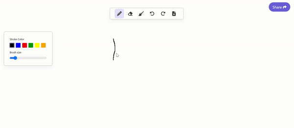
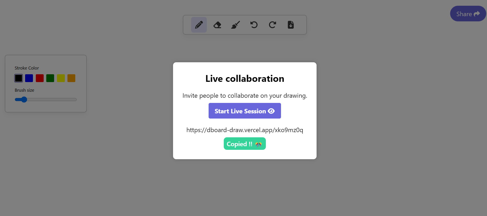

## Dboard :: Real-time Collaborative Drawing App

 

### Overview

This project is a real-time collaborative drawing application inspired by Excalidraw. It allows multiple users to join unique drawing sessions via shareable URLs and collaborate on a shared canvas in real-time.

## Features

- **Real-time Collaboration**: Multiple users can draw simultaneously on the same canvas.
- **Unique Sessions**: Each session has a unique URL, ensuring private and distinct drawing spaces.
- **Drawing Tools**: Supports various drawing tools and configurations such as color and brush size.
- **Undo/Redo**: Allows users to undo and redo their drawing actions.
- **Download**: Users can download their drawings as a PNG image.
- **Clear Canvas**: Users can clear the entire canvas.

## Tech Stack

- **Next.js**: React framework for building the front end.
- **Express.js**: Backend server for handling socket connections.
- **Socket.io**:  For Real-time, bidirectional, and event-based communication.
- **Redux**
- **Tailwind CSS**

- Backend hosted on Render , UI on vercel
